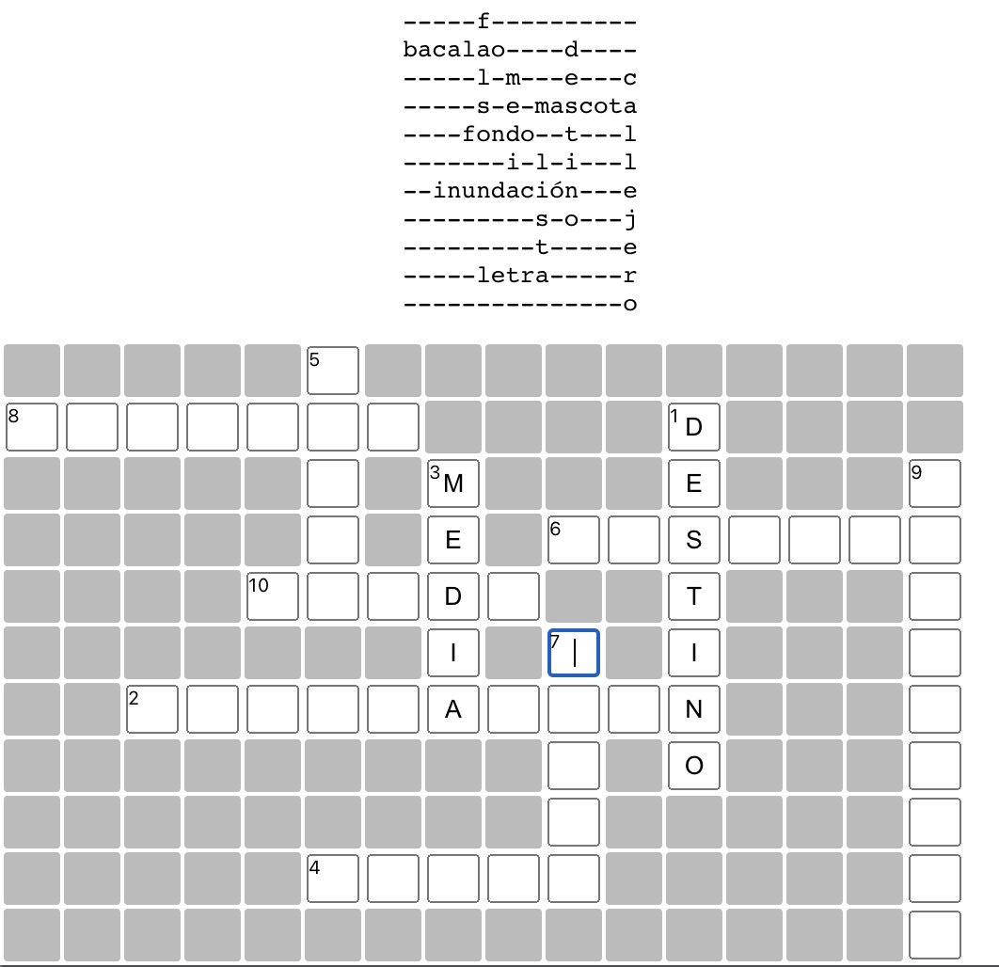
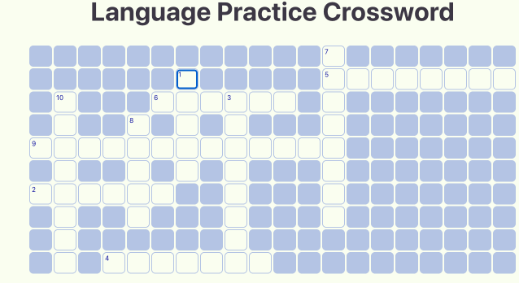
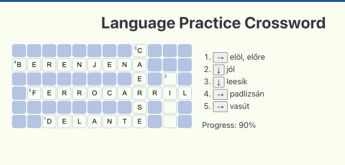
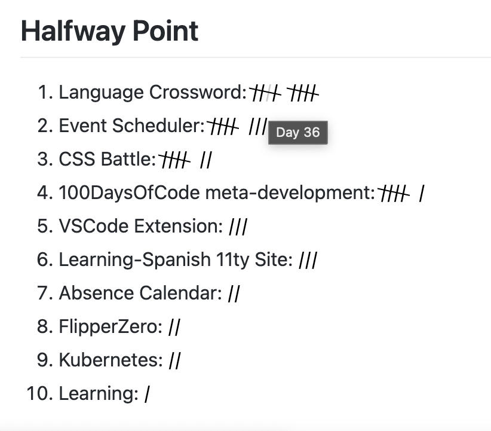

# 100 Days Of Code - Log



{::nomarkdown}
<div id="tooltip">...</div>
<script>

</script>
<style>

</style>
{:/}

## Day 1: 2022-07-02

[Tweet](https://twitter.com/BudavariMatyas/status/1543250339385823232)

**Today's Progress**: I'll try to move my english hardcore softwaredev tweets and retweets to my alt account
`@BudavariMatyas`, let's see how it goes 🤞

**Thoughts**: I can consider this as the beginning, since this is the marker when I started to split my dev and personal accounts on twitter, even though I did not mark it explicitly.

## Day 2: 2022-07-02

[Tweet](https://twitter.com/BudavariMatyas/status/1543252557954514944)

**Today's Progress**: I've made my header with `#p5js` 👀

**Thoughts**: What I like the most in this is that it supports dark mode and stops the animation for those who prefer reduced motion.

**Link(s) to work**: [p5.js Web Editor](https://editor.p5js.org/budavariam/full/0k6O1bWdc)

## Day 3: 2022-07-05

[Tweet](https://twitter.com/BudavariMatyas/status/1544366260342890497)

**Today's Progress**: I missed the last battle, but it's still nice to practice CSS with `@css_battle`

**Thoughts**: I love to think about css alignment, css battles are coming.

**Link(s) to work**: [Curtain - Mátyás Budavári](https://budavariam.github.io/css-battle-showcase/battles/19-spacing/109-curtain)

## Day 4: 2022-07-06

[Tweet](https://twitter.com/BudavariMatyas/status/1544758709561303041)

**Today's Progress**: At last got enough points to get into the global leaderboard!

`#smallSteps` 8925th / 209746

`#cssbattle` `#100DaysOfCode`

**Thoughts**: I thought 3D would ake it easy for me, I spent too long that I'd feel safe to admit to align it perfecctly. The diff helps a LOT.

**Link(s) to work**: [Black Light - Mátyás Budavári](https://budavariam.github.io/css-battle-showcase/battles/19-spacing/113-black-light)

## Day 5: 2022-07-07

[Tweet](https://twitter.com/BudavariMatyas/status/1545117522613207043)

**Today's Progress**: `#100daysOfCode` day 5:

I wanted to visualise custom multi-day events in a calendar for a while, let's see how it goes.

is pretty easy to use, it can be embedded in a few lines of code.
I'll have many ideas how to fine tune it...

**Thoughts**: It was just a proof of concept, but I have high hopes in this one.

**Link(s) to work**: [FullCalendar - JavaScript Event Calendar](https://fullcalendar.io/)


## Day 6: 2022-07-08

[Tweet](https://twitter.com/BudavariMatyas/status/1545446006136897536)

**Today's Progress**: `#100DaysOfCode` Day 6

I made a script to get size of folders per date from an s3 bucket using `#s3curl` and visualized it with `#plotlyJS`

I had around 1 hour time limit for learning and coding. Besides a nasty typo in "marker" based pagination, everything worked on the first try 🎉

**Thoughts**: It was an amazing exercise, if I'll need to use it again I pimp it up to a shareable form.

## Day 7: 2022-07-14

[Tweet](https://twitter.com/BudavariMatyas/status/1547713647815733250)

**Today's Progress**: `#100DaysOfCode` Day 7:

Practice CSS rotation and its quirks at `#cssbattle`

**Thoughts**: Some browsers handle the border with rotation pretty badly even if I tell that I'll transform it. At least the css battle server accepted it.

**Link(s) to work**: [Tesseract - Mátyás Budavári](https://budavariam.github.io/css-battle-showcase/battles/1-pilot/9-tesseract)

## Day 8: 2022-07-15

[Tweet](https://twitter.com/BudavariMatyas/status/1547993617137954822)

**Today's Progress**: `#100DaysOfCode` Day 8

Today I got an hour to polish my calendar viewer that I wrote about a few days ago. It still has a long way to go but now it's usable enough for my needs.
I've added a github action to deploy it, and fixed some onboarding issues.

**Thoughts**: I needed to revisit date handling, but now it has a proper onboarrding experrience for newcomers. Mobile view is still a mess.

**Link(s) to work**: [Absence Calendar](https://budavariam.github.io/absence-calendar/)


## Day 9: 2022-07-16

[Tweet](https://twitter.com/BudavariMatyas/status/1548334043460018178)

**Today's Progress**: `#100DaysOfCode` Day 9

Today I've started to log my progress properly on github as well.
In order to avoid having to manually duplicate the text I write here, I've created a small python script to get these entries via TwitterAPI

`#100Devs`

**Thoughts**: It was a fun experience, I have some ideas where to go next with this. It took more than I expected, I'm glad I switched to python early on.

**Link(s) to work**: [100-days-of-code/main.py at master · budavariam/100-days-of-code](https://github.com/budavariam/100-days-of-code/blob/master/utils/twitter/main.py)

## Day 10: 2022-07-17

[Tweet](https://twitter.com/BudavariMatyas/status/1548722515379458050)

**Today's Progress**: `#100DaysOfCode` Day 10

I've started to log my journey on learning `#spanish` in `#hungarian` using `#11ty`

My usual steps of writing about a new topic:
- Get a static site generator
- Browse themes
- Choose a different SSG
- Switch theme
- Rewrite the theme

**Thoughts**: I struggled between learning a new flavour of static site generators or use one that I already know. So I chose one that I've used a bit. I decided to spend this day organizing my spanish learning material, now I'll have a place to put them moving forward.

**Link(s) to work**: [Learning Spanish](https://budavariam.github.io/learning-spanish/)

## Day 11: 2022-07-18

[Tweet](https://twitter.com/BudavariMatyas/status/1549151425418219525)

**Today's Progress**: Day 11 of `#100DaysOfCode`

Today I took it easy and got the basis for further development. I've added csv-processor for a new word list table in my spanish learning page.

**Thoughts**: It took me a while to figure out how to load csv data, but luckily with eleventy I can define custom data inputs.

**Link(s) to work**: [Szavak](https://budavariam.github.io/learning-spanish/szavak/)

## Day 12: 2022-08-01

[Tweet](https://twitter.com/BudavariMatyas/status/1554210080802967558)

**Today's Progress**: `#100DaysOfCode` Day 12

I mixed `#appleScript` and `#python` to extract events from the Calendar app and add filtered events back into another calendar for the next few weeks.

The most tricky part was handling the recurrent rule format to regenerate the events, and ofc `#timezones`

**Thoughts**: The sad part with the events handled in Calendar app is that AFAIK I can not query for a specific time interval in the future. Rather I have to get ALL events, parse their recurrence rules (shoutout to [dateutil.rrule](https://dateutil.readthedocs.io/en/stable/rrule.html)) and generate when they occur and filter to the given date.
There might be a simpler method, I hadn't not yet found any. Other than this I needed to chase down a nasty case.

```log
INFO:generate_event_dates "2022/03/11 17:15:00", "FREQ=WEEKLY;UNTIL=20220915T132959Z"
...
ValueError: RRULE UNTIL values must be specified in UTC when DTSTART is timezone-aware
```

## Day 13: 2022-08-12

[Tweet](https://twitter.com/BudavariMatyas/status/1558191455402921985)

**Today's Progress**: `#100DaysOfCode` Day 13

I've started dusting off my ancient C knowledge and getting my hands dirty with custom `#flipperzero` plugin development.
Today I successfully built a custom firmware with a basic hello word app.

**Thoughts**: I need to revisit many things from the university C classes. I was surprised how easy it was to build my app as needed. I'd bee happy to have some kind of emulator or debugger. We'll see.

## Day 14: 2022-08-14

[Tweet](https://twitter.com/BudavariMatyas/status/1558762543904169985)

**Today's Progress**: `#100DaysOfCode` Day 14

I've created a `#flipperZero` plugin in C that plays Conway's Game of Life.

**Thoughts**:

**Link(s) to work**: [[Plugin] Conway's Game of Life by budavariam · Pull Request #1 · budavariam/flipperzero-firmware](https://github.com/budavariam/flipperzero-firmware/pull/1)


## Day 15: 2022-08-21

[Tweet](https://twitter.com/BudavariMatyas/status/1561328865305321473)

**Today's Progress**: `#100DaysOfCode` Day 15

I've added a simple `#darkMode` switch to my `#11ty` site. That'll make it easier for me to find the best color scheme later on.
A media query was already there for dark mode in the 11ty/eleventy-base-blog theme. Now my DevEx is better.

**Thoughts**:

**Link(s) to work**: [Add basic dark mode by budavariam · Pull Request #1 · budavariam/learning-spanish](https://github.com/budavariam/learning-spanish/pull/1/files)

## Day 16: 2022-08-22

[Tweet](https://twitter.com/BudavariMatyas/status/1561835199213838340)

**Today's Progress**: `#100DaysOfCode` Day 16

In order to see how I perform in this challenge, I started to create an automated git chart-like progress meter. Boxes have different colors based on the number of reactions to these tweets. Hope it helps me be more consistent. 📈

**Thoughts**: This is not ready yet, I have some improvement ideas already. The tricky part will be to add hovering and navigation.

**Link(s) to work**: [100 Days Of Code - Log](https://budavariam.github.io/100-days-of-code/log.html)


## Day 17: 2022-08-23

[Tweet](https://twitter.com/BudavariMatyas/status/1562179840664653824)

**Today's Progress**: `#100DaysOfCode` Day 17

Today I took a deep dive into Kubernetes' job parallelization options and configurations.

**Thoughts**: Time well spent.

## Day 18: 2022-08-24

[Tweet](https://twitter.com/BudavariMatyas/status/1562476098428219393)

**Today's Progress**: `#100DaysOfCode` Day 18

Today I took an unplanned deep dive into `#kubernetes` networkPolicies and network-related investigations tackling possible kube-dns issues, port forwarding, and probing different service port accesses

**Thoughts**: Long ride with a happy end. Learned a lot, and cleared up many of my assumptions. Now I want to have a custom docker image even more, that has all my favourite debbugging tools. I need at least `netcat`/`telnet`, `ping`, `nslookup`, `dig`, `bash`, `python`, `curl`/`wget`

## Day 19: 2022-08-25

[Tweet](https://twitter.com/BudavariMatyas/status/1562853199744466945)

**Today's Progress**: `#100DaysOfCode` Day 19 

I've added minor enhancements to my progress page. I ensured that the minimal default `#jekyll` `#githubPages` template embeds the SVG, then I added basic tooltips and click navigation handling to my contribution chart.

**Thoughts**: I still see many parts to improve, better fonts, nicer look for the small boxes, and showing the day number in the tooltip. Mobile view, tooltip shall not get out of the scrreen, but it's good for now.

**Link(s) to work**: [100 Days Of Code - Log](https://budavariam.github.io/100-days-of-code/log.html)


## Day 20: 2022-08-31

[Tweet](https://twitter.com/BudavariMatyas/status/1565068098067128320)

**Today's Progress**: `#100DaysOfCode` Day 20

Today I revisited vim commands and shortcuts.
In the meantime, I've fixed many typos in my cheat sheet 🙈

**Thoughts**: I did not forget as much as I thought.

**Link(s) to work**: [learn-vim/vim-cheatsheet.md at master · budavariam/learn-vim](https://github.com/budavariam/learn-vim/blob/master/vim-cheatsheet.md)

## Day 21: 2022-09-01

[Tweet](https://twitter.com/BudavariMatyas/status/1565115297635393538)

**Today's Progress**: `#100DaysOfCode` Day 21

I've recreated this Pac-Man scene in "just" 482 bytes of `#css`! Having fun in this crazy `#cssBattleChallenge` golfing game via `@css_battle`

**Thoughts**: This was the first time I used box-shadow in cssBattle, totally worth it. It's also nice to put in my trials into github so that I can learn from the steps later.

**Link(s) to work**: [Pacman - Mátyás Budavári](https://budavariam.github.io/css-battle-showcase/battles/20-hover/119-pacman)

## Day 22: 2022-09-02

[Tweet](https://twitter.com/BudavariMatyas/status/1565780451389734915)

**Today's Progress**: `#100DaysOfCode` Day 22

Since I've made a design mistake of trusting my twitter posts timestamps for the progress logs, I needed to revisit my python datetime parsing knowledge and figure out a sweet compromise with my daily schedule. I'll use UTC+1 instead of CET to gain an hour.

**Thoughts**: I still messed up the first day, but whatevs.

## Day 23: 2022-09-06

[Tweet](https://twitter.com/BudavariMatyas/status/1567267419491631106)

**Today's Progress**: `#100DaysOfCode` Day 23

I started to get familiar with VSCode extension creation. I went through getting started guides and started to tweak sample codes

I'd like a new functionality, that I hadn't yet found an extension for. Let's see if it's possible and whether I can create it

**Thoughts**: I've already found some seemingly blocker problems, but I'm still taking a deep dive into the docs.

## Day 24: 2022-09-07

[Tweet](https://twitter.com/BudavariMatyas/status/1567627459410919424)

**Today's Progress**: `#100DaysOfCode` Day 24

I've created a POC usable working version of my very first `#VSCodeExtension`

It adds static autocomplete values into my .md files under optionally specified paths. I can even customize description texts or icons, all from the config

**Thoughts**: I extracted my code from yesterday's poc and was able to generate a new config, and even figure out how to debug it. The activators tricked me. It's probably not the most performant extension ever, but I only plan to use it locally just yet.

**Link(s) to work**: [GitHub - budavariam/vscode-static-autocomplete: Static Autocompletion into Markdown documents](https://github.com/budavariam/vscode-static-autocomplete)

## Day 25: 2022-09-08

[Tweet](https://twitter.com/BudavariMatyas/status/1567929821103013889)

**Today's Progress**: `#100DaysOfCode` Day 25

I added a command to my `#VSCodeExtension` to reload the static autocomplete items

I added a  *contributes.configuration* part into the metadata info

I started to experiment with ConventionalCommits and I also updated the changelog

**Thoughts**: I'd like to add proper github releases and figure out a better git tagging experience. The docs are still ugly and unchanged, also I might see how can I publish an extension soon.

**Link(s) to work**: [[0.0.2] Reload configurations by budavariam · Pull Request #1 · budavariam/vscode-static-autocomplete](https://github.com/budavariam/vscode-static-autocomplete/pull/1/files)

## Day 26: 2022-09-09

[Tweet](https://twitter.com/BudavariMatyas/status/1568290890136932356)

**Today's Progress**: `#100DaysOfCode` Day 26

Today I rethought my daily processes

For my upcoming meetings, I can automatically set up schedules to open templated notes just a few minutes before the meetings

'at' seems perfect for scheduling later execution.
I made it work

**Thoughts**: cronjobs is not idiomatic forrr this task, nor do I want to keep a serveer running for this. `at` seems perfect. I'll start it from python. I saw it working, just have to connect with csvlike eventlist reading and add some "AI" for meeting vs template matching.

**Link(s) to work**: [at (command) - Wikipedia](https://en.wikipedia.org/wiki/At_(command))

## Day 27: 2022-09-10

[Tweet](https://twitter.com/BudavariMatyas/status/1568710841410650112)

**Today's Progress**: `#100DaysOfCode` Day 27

Today I quickly drafted the wireframe of the POC for my automated meeting-note creator/opener. The base functionality works, need to polish it.

I learned about queues in 'at', I can simply categorize my schedules, and it's easy to clear a subset of jobs.

**Thoughts**: I need to come  up with the proper data structures, but the job reset and creation already works. I think it might work properly next week

## Day 28: 2022-09-11

[Tweet](https://twitter.com/BudavariMatyas/status/1569025458745839617)

**Today's Progress**: `#100DaysOfCode` Day 28

I've worked on my meeting note auto-opener. I've put together templates for different event categories and coded the template selection logic.

I cleaned up the code and moved the configurable parts closer together

I can see how it fits me from tomorrow 🚀

**Thoughts**: I need to clean up the input CSV generator logic. I use a really old event list generator that I need to enhance.

## Day 29: 2022-09-12

[Tweet](https://twitter.com/BudavariMatyas/status/1569407287311073281)

**Today's Progress**: `#100DaysOfCode` Day 29

Today I saw that my calendar-based auto note-opener worked like a charm in a real-life scenario 🤓🥳

I cleaned up the logs into human-readable form for regular usage. I moved the detailed info into debug/trace level. I also handled some tricky exceptions

**Thoughts**: I did not have mmuch time to develop, I use uuid-s for the events in case they don't have proper identifiers

## Day 30: 2022-09-13

[Tweet](https://twitter.com/BudavariMatyas/status/1569578806306013190)

**Today's Progress**: `#100DaysOfCode` Day 30

I optimized the single-day event collection speed ⚡️

Getting events from Calendar app is tricky. For reoccurring events, you must get the original entry to tell today's ones

BUT by using `#PyObjC`, I could fetch the events from the CalendarStore directly 🎉

**Thoughts**: Today I wanted to switch to a new calendar. The `Calendar` app could not comprehend the size of my new calendar for event collection. Luckily I was using `.csv` for the events from the start, so I could extract the generator logic in any way I wanted.

## Day 31: 2022-09-14

[Tweet](https://twitter.com/BudavariMatyas/status/1570141207472242690)

**Today's Progress**: `#100DaysOfCode` Day 31

Today I tweaked my calendar-based auto note-opener

I added `#osascript` dialog prompt for meetings without a defined template. Asking the user if it should create the notes or not

I unified the logging messages and made sure that error messages are kept

**Thoughts**: I see many ways to improve the extensibility of my code. I'm thinking of adding more templates to choose from per event type.

## Day 32: 2022-09-16

[Tweet](https://twitter.com/BudavariMatyas/status/1570663146305589248)

**Today's Progress**: `#100DaysOfCode` Day 32

Today I got started with `@NotionHQ` API. I learned how to create and connect an integration to a db.

I've added an option to my calendar-based auto note-opener to create new notes in Notion, then open the application if it's available, otherwise open in web

**Thoughts**: I wanted to try how tweet scheduling works. I failed to hit the schedule button when I started to edit, so I lost a day again...

## Day 33: 2022-09-17

[Tweet](https://twitter.com/BudavariMatyas/status/1571060491702931457)

**Today's Progress**: `#100DaysOfCode` Day 33

An ongoing battle at `@css_battle` is available at 👉 ⚔️

🎨 I've been working on my solutions in the last few days.

📈 I still have room for improvement

**Thoughts**: The positioning in the letter R is not good at all... I need to look at some better positioning hacks.

**Link(s) to work**: [CSSBattle](https://cssbattle.dev/battle/21)

## Day 34: 2022-09-18

[Tweet](https://twitter.com/BudavariMatyas/status/1571614391224647682)

**Today's Progress**: `#100DaysOfCode` Day 34

Today I drafted a random crossword generator to help me practice Spanish words in a daily manner

**Thoughts**: I have the stack, I collected some words POC is on the way.

## Day 35: 2022-09-19

[Tweet](https://twitter.com/BudavariMatyas/status/1571966424771448837)

**Today's Progress**: `#100DaysOfCode` Day 35

I created a POC for my daily 🇪🇸 crossword puzzle. 

- It collects the same words throughout the current day
- Added a base HTML/CSS template for the layout
- Users can only enter a single letter or remove the current one

Shoutout to [npm: crossword-layout-generator](https://www.npmjs.com/package/crossword-layout-generator)

**Thoughts**: I started to write this code in React, eventually I'd like to add it to my 11ty site `learning-spanish`. I might transform it into a web component just to see how they work.

**Link(s) to work**: [npm: crossword-layout-generator](https://www.npmjs.com/package/crossword-layout-generator)



## Day 36: 2022-09-20

[Tweet](https://twitter.com/BudavariMatyas/status/1572297792189595651)

**Today's Progress**: `#100DaysOfCode` Day 36

🤖 I coded a heuristic in my language practice crossword to make it automatically move to the next slot upon filling the fields

💡Now that I look at this animation, I got some idea of how to make it better

**Thoughts**: I took more time than I expected with this auto navigation, I'd like to handle backspace and arrow key navigation is well. I don't want to capture tab for the game.



## Day 37: 2022-09-22

[Tweet](https://twitter.com/BudavariMatyas/status/1573013894745964546)

**Today's Progress**: `#100DaysOfCode` Day 37

I use `@toggltrack` to help me track the time I spend on different work projects.

Though some personal ones should not appear on my weekly timesheet.

Today I've added an option to my helper tool not to render the hidden lines at all

**Thoughts**: I had little time to code, though this addition helps me a lot. I might add a simple MUI checkmark to each line to let me mark them as completed while filling out the timesheet.

**Link(s) to work**: [Time Tracker](https://budavariam.github.io/timesheet-helper/)

## Day 38: 2022-09-23

[Tweet](https://twitter.com/BudavariMatyas/status/1573362387746684929)

**Today's Progress**: `#100DaysOfCode` Day 38

Today I needed to assign specific people to week-long tasks.

I wrote a simple `#JavaScript` code to automate the `#GoogleCalendar` event creation. Upon creation, it also gave me a report on what events have been created.

Helpful docs:

**Thoughts**: It speeded up manual work, still has potential for improvement. Thoug I don't want to solve vague nonexistent problems yet.

**Link(s) to work**: [Import events to Google Calendar - Computer - Google Calendar Help](https://support.google.com/calendar/answer/37118#advanced&zippy=%2Ccreate-or-edit-a-csv-file)

## Day 39: 2022-09-24

[Tweet](https://twitter.com/BudavariMatyas/status/1573600909564731392)

**Today's Progress**: `#100DaysOfCode` Day 39

Today I polished my minimal `#LanguageCrossword` implementation.

🧮 Progress counter gives some further hints

🔀 Jump button shows the word orientation from now on

🎉 Upon completion,  `#canvasConfetti` ensures the festive mood

**Thoughts**: It has the base functionality to go live, but the code is a mess. I need to clean it up, and figure out what is the easiest way to render it into my Language Practice website without adding the source code over there.



## Day 40: 2022-09-25

[Tweet](https://twitter.com/BudavariMatyas/status/1573971871179186178)

**Today's Progress**: `#100DaysOfCode` Day 40

🕹️ I played with `@css_battle`'s current `#CSSBattleChallenge`

🏡 I rediscovered a shorthand recently, so I went through other battles to apply and increase my score

🦄 I guess Unicode characters could spice up my game at this point

**Thoughts**: I found a unicode character tester site, but I didn't take a deepdive into it yet, with positioning at least I feel like I solve scenarios that could appear in the real world.

**Link(s) to work**: [Letter N - Mátyás Budavári](https://budavariam.github.io/css-battle-showcase/battles/21-rotate/128-letter-n)

## Day 41: 2022-09-26

[Tweet](https://twitter.com/BudavariMatyas/status/1574510939864530944)

**Today's Progress**: `#100DaysOfCode` Day 41

Today I looked at possibilities for embedding my `#createReactApp` React.js `#LanguageCrossword` POC codebase into my Spanish Learning `@eleven_ty` static website. 

`#100Devs` what do you think would be the best?

- Embed in an iframe
- Make it a WebComponent
- Eleventy React Template
- ...I'll tell in a comment

**Thoughts**: I'd prefer to choose the simplest solution. It'd be great to have a demo site for the corsswoord while it can be embedded to other pages with minimal effort. I imagine WebComponents should be elements that are meant to be reused in multiple places. Eleventy Renderer is experimental, though it might worth a try.
Iframe seems to be the simplest of all.
I could just render react in the static site.

## Day 42: 2022-09-27

[Tweet](https://twitter.com/BudavariMatyas/status/1574878488397488159)

**Today's Progress**: `#100DaysOfCode` Day 42

📚 I looked into WebComponents in general

🔥 I checked out the popular `@buildWithLit`

🚀 I tried `@direflowjs` on my static site

I'm pretty happy with the progress

**Thoughts**: I wish my code will work exactly as I intended it with the help of DireFlow, otherwise comes planB. Refactor and rewrite.

## Day 43: 2022-09-28

[Tweet](https://twitter.com/BudavariMatyas/status/1575217028066967552)

**Today's Progress**: `#100DaysOfCode` Day 43

I fixed the minor issues when migrated my React component into `@direflowjs` `#webComponent`

🌴 Could not add :root for CSS properties. I added them to my root className

🔎 The document.getElementById calls did not work. I replaced them to ref.querySelector()

**Thoughts**: I'm happy that CSS variables propagate through. I can easily use the already existing dark theme from my site.

## Day 44: 2022-09-29

[Tweet](https://twitter.com/BudavariMatyas/status/1575527322916102145)

**Today's Progress**: `#100DaysOfCode` Day 44

🎉 I released the MVP of my 🇪🇸Crossword  `#WebComponent` to help my classmates as well

📵 At first, I thought it wouldn't work well on mobile, but I was able to pinpoint and fix the major issues

💡 I already got positive feedback

**Thoughts**: I found some minor bugs, sadly only the v0.0.6 npm version was the one I was satisfied with enough to let it out of my hands in minified form. I'm still not proud of the source code.

**Link(s) to work**: [Learning Spanish Keresztrejtvény](https://budavariam.github.io/learning-spanish/crossword/)

## Day 45: 2022-09-30

[Tweet](https://twitter.com/BudavariMatyas/status/1575884558104305671)

**Today's Progress**: `#100DaysOfCode` Day 45

I played the current  `#CSSBattleChallenge` at `@css_battle` 

🕐 I think these were my fastest solutions yet

🎁 box-shadow came in handy as a clone tool

🎨 I learned a new trick: I can exploit that its default color is "currentcolor"

**Thoughts**: I finally created an init shell script that helps with starting a new challenge. These challenges seemed pretty easy, or I'm starting to get into it.

**Link(s) to work**: [Letter B - Mátyás Budavári](https://budavariam.github.io/css-battle-showcase/battles/21-rotate/129-letter-b)

## Day 46: 2022-10-01

[Tweet](https://twitter.com/BudavariMatyas/status/1576119915232186369)

**Today's Progress**: `#100DaysOfCode` Day 46

📝 Today I started to get familiar with Zettelkasten note taking method

🎓 I'm in an endless process of rethinking and improving my current knowledge management system

**Thoughts**: Nice idea, I'll need to learn more to see how it fits my system

**Link(s) to work**: [Zettelkasten knowledge and info management • Zettelkasten Method](https://zettelkasten.de/)

## Day 47: 2022-10-02

[Tweet](https://twitter.com/BudavariMatyas/status/1576663280730660864)

**Today's Progress**: `#100DaysOfCode` Day 47

I started to clean up my LanguageCrossword React code

🌀 Improved my `#developerExperience` by automating repetitive tasks

⌨️ Added `#Typescript` to the mix, started to define the interfaces and types

🌐 Got rid of global variables

🔬 Fixed styling issues

**Thoughts**: Currently there are still more `any` then what's healthy, but as soon as I get a storybook-like component and split out functionality into their own files it'll be much less mind-boggling to add new features

## Day 48: 2022-10-03

[Tweet](https://twitter.com/BudavariMatyas/status/1576975706189627393)

**Today's Progress**: `#100DaysOfCode` Day 48

I improved my LanguageCrossword a bit today.

🏗️ I calculated new progress metrics to help me provide additional hints

📈 I strike through the completed words hoping that it might improve engagement

🧹 I continued code cleanup

**Thoughts**: I did not have much time today to imprve my code, did my best in this short time. Just had to sit down and code the logic. I hopee that after I finish the typescript rewrite and code split I'll be able to code ideas like much faster.

**Link(s) to work**: [Learning Spanish Keresztrejtvény](https://budavariam.github.io/learning-spanish/crossword/)

## Day 49: 2022-10-04

[Tweet](https://twitter.com/BudavariMatyas/status/1577377889053556736)

**Today's Progress**: `#100DaysOfCode` Day 49

Today I spent some time browsing through `#Hacktoberfest` tags on Twitter, GitHub, and DEV to find tips on how to have meaningful contributions.

I'm still looking for an `#OpenSource` project to contribute to.

**Thoughts**: I've been trying to get involved for 3 years now with no luck. I wonderr how it will be this year.

## Day 50: 2022-10-05

[Tweet](https://twitter.com/BudavariMatyas/status/1577775981191995398)

**Today's Progress**: `#100DaysOfCode` Day 50

☕️ I took some time to revisit my progress

🍦 I had fun with `#VanillaJS` to create navigable statistics in my progress log out of the top 10 topics

🧮 I implemented hoverable `#CSS` tally marks

**Thoughts**: I just drafted this code, it's not best practice, but it felt good revisiting it. I figured that :has() is capable of counting the number of children... The future of CSS is promising.

**Link(s) to work**: [100 Days Of Code - Log](https://budavariam.github.io/100-days-of-code/log.html#halfway-point)



## Halfway Point

{::nomarkdown}
<script>

</script>
<style>

</style>
{:/}

## Day 51: 2022-10-06

[Tweet](https://twitter.com/BudavariMatyas/status/1578140510933643264)

**Today's Progress**: `#100DaysOfCode` Day 51

🎨 Today I learned about radial-gradient filter in `#CSS` 

⚔️ I tried to use my fresh knowledge with the latest cssbattles, but could not pass 99.9% yet

🧙 I learned a new trick: copy only a single border with "filter: box-shadow"

**Thoughts**: It's frustrating to see the bad borders and I don't know what parts are failing the diff...

**Link(s) to work**: [Learn CSS radial-gradient by Building Background Patterns](https://www.freecodecamp.org/news/css-radial-gradient/)

## Day 52: 2022-10-07

[Tweet](https://twitter.com/BudavariMatyas/status/1578441776620265472)

**Today's Progress**: `#100DaysOfCode` Day 52

I pushed my language crossword web component one step closer to a proper standalone reusable entity 🥳

💬 Starting from version 0.0.10, the dictionary is replaceable. It is loaded from an URL from now on

🔒 The dictionary is kept in localstorage for a day

**Thoughts**: It's usable from now on with a custom dataset, and spec characters can be added at last.

## Day 53: 2022-10-08

[Tweet](https://twitter.com/BudavariMatyas/status/1578840342618865665)

**Today's Progress**: `#100DaysOfCode` Day 53

I drafted another component for my language learning site: a simple word list viewer with fuzzy search filtering, category and word class filter would be an extra.

It could work from the same data format as what the crossword uses.

**Thoughts**: I wanted to use proper word list for a while now, let's see what I can get

## Day 54: 2022-10-09

[Tweet](https://twitter.com/BudavariMatyas/status/1579218013563518977)

**Today's Progress**: `#100DaysOfCode` Day 54

Today I started to code my WordList web component

🖼️ I started to get familiar with `@buildWithLit` templating

🚧 I created a POC with the bare minimum functionality

🧭 I connected `@fusejs` for a fuzzy search on the change event

**Thoughts**: I was able to fire up a starter project with a bunch of boilerplate... will take some time to push it to prod

## Day 55: 2022-10-10

[Tweet](https://twitter.com/BudavariMatyas/status/1579601659126501377)

**Today's Progress**: `#100DaysOfCode` Day 55

I started to clean up my word finder POC

⚖️ I created a prod rollup bundle to let me use it as a standalone item

📒 I used a valid name instead of my-component and pushed it to npm

🚀 I embedded it into my language learner site

**Thoughts**: I did not  have much time, I could not figure out why rollup did not like the summary part, nevertheless I cleaned up a lot of mess in that repo, npmignored a bunch of stuff

**Link(s) to work**: [Learning Spanish Szavak](https://budavariam.github.io/learning-spanish/szavak/)

## Day 56: 2022-10-16

[Tweet](https://twitter.com/BudavariMatyas/status/1581584411111608320)

**Today's Progress**: `#100DaysOfCode` Day 56

🎉 Our team got 3rd place at the company-wide Hackathon

🚂 We created a new internal site for managing travel expense reimbursement

👷 Our service extracts data from the pdfs and organizes them in the desired way to decrease manual workload

**Thoughts**: I had some thoughts on how to create a rocking presentation, I might write a blogpost on it

## Day 57: 2022-10-23

[Tweet](https://twitter.com/BudavariMatyas/status/1584263301487218688)

**Today's Progress**: `#100DaysOfCode` Day 57

🔖 Learned about data fetching in `#lit` `#webcomponent`, looked into the "until" function to print a message until my Promise resolves

↘️  Updated my wordlist component in my Spanish learning site to work from the same data source as what my crossword uses

**Thoughts**: I started to implement this in a waaay more complicated than I should have. But got back on track. The look and feel is still a bit of a mess, but I can start to improve the word list.

## Day 58: 2022-11-01

[Tweet](https://twitter.com/BudavariMatyas/status/1587537403220303875)

**Today's Progress**: `#100DaysOfCode` Day 58

⚔️ I tried once again to finish the last 2 battles of the latest `#cssBattleChallenge`

🔄 I found a simple rotate + drop shadow solution for 132. The positioning could be simplified

🚧 I can not yet get past 99.9% in challenge 131

**Thoughts**: This 131 drives me crazy. I think I found an elegant way, but it still does not work

**Link(s) to work**: [letter-s - Mátyás Budavári](https://budavariam.github.io/css-battle-showcase/battles/21-rotate/132-letter-s)

## Day 59: 2022-11-07

[Tweet](https://twitter.com/BudavariMatyas/status/1589722510563905536)

**Today's Progress**: `#100DaysOfCode` Day 59

I read about AWS ALBs, debugged a misbehaving Ingress in EKS, issued certificates and wrote a step-by-step guide for my future self

I dusted off my DevOps knowledge of CI/CD pipelines and branching strategies

I finished the remaining `#oitm` coding tasks

**Thoughts**: Bunch of learning, not so visible

## Day 60: 2022-11-08

[Tweet](https://twitter.com/BudavariMatyas/status/1590021000401670152)

**Today's Progress**: `#100DaysOfCode` Day 60

Continued my AWS journey by getting some on-hands experience in RDS

I set up external database connections and practiced data migration in a small dataset

**Thoughts**: I love in AWS how easy it is to change configuration values, and I don't like how it keeps me in the dark if something is not right...

## Day 61: 2022-11-15

[Tweet](https://twitter.com/BudavariMatyas/status/1592416364815581184)

**Today's Progress**: `#100DaysOfCode` Day 61

I set up a local dev proxy to closely inspect the packets of a strange-behaving web app

Chrome can be started with proxy settings via CLI. 
No need to temper with the network. e.g. on macOS:

open -a "Google Chrome" --args --proxy-server=localhost:8080

**Thoughts**: It blew my mind how easy it was to set it up. And how easy it is to add code rewrite if I need to mock some parts of the app temporarily without having to stop or restart the service

## Day 62: 2022-11-16

[Tweet](https://twitter.com/BudavariMatyas/status/1592980991756599300)

**Today's Progress**: `#100DaysOfCode` Day 62

👑 We found Kinder Surprise Kings during shopping and it inspired us to improvise a basic nativity scene from what we have at home

🔍 As a fun experiment, we 3D scanned it, and I dusted off my three.js knowledge to load a GLTF file

**Thoughts**: I've found a basic example in codesandbox, I wanted to export it from the beginning to a place. The github pages export worked flawlessly, but it looked like a mess, the source code was not there etc. And the deployed stuff did not work, because the basic example was built with parcel, but it missed the static asset copy plugin... I then created a github project, fixed the issues and added a github workflow to deploy to github pages. I love the end result. We might make a christmas card out of it with some animation or snowing...

**Link(s) to work**: [THREE.js](https://budavariam.github.io/threejs-glb-experiment/)

## Day 63: 2022-11-19

[Tweet](https://twitter.com/BudavariMatyas/status/1594092050668224512)

**Today's Progress**: `#100DaysOfCode` Day 63

☸️ I've started to summarize my last few years of working with Kubernetes into a blog post

👷 I aim to have a post I can use as a guide to help anyone through the basics who haven't worked with it yet

🧐 Also, to have my own cheatsheet for my future self

**Thoughts**: It's going to be a loooong post. I spent more time so far looking for a specific meme about networking than with the text itself...

## Day 64: 2022-11-20

[Tweet](https://twitter.com/BudavariMatyas/status/1594419615098183683)

**Today's Progress**: `#100DaysOfCode` Day 64

✍️ I took some time to revamp my blog post about my experiences and takeaways from our latest Hackathon project.

🙈 Finally published it with a little over a month delay

**Thoughts**: It was a fun project, made me happy to think about it, and write my experience

## Day 65: 2022-11-21

[Tweet](https://twitter.com/BudavariMatyas/status/1594750144448430080)

**Today's Progress**: `#100DaysOfCode` Day 65

I've found another set of interesting issues with my sqlldr ctrl:

🔢 If I load from a CSV field that has &gt;255 characters, I have to set the char number

🗒️ I can not easily load blob data, even if it's text

📅 Date format is needed if it's not the default

**Thoughts**: I start to get the hang of working with Oracle. It's a bit tiring though.

## Day 66: 2022-11-22

[Tweet](https://twitter.com/BudavariMatyas/status/1595149956121186304)

**Today's Progress**: `#100DaysOfCode` Day 66

I looked into linters and formatters to see which ones are trending in 2022 to pick my new favorite.

I see now I can even choose between opinionated and configurable

**Thoughts**: I like pylint and black for python. ESLint and prettier for javascript
