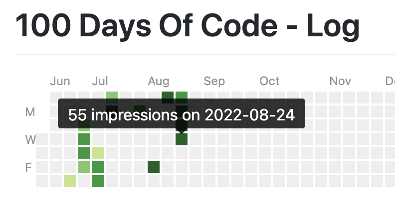

# 100 Days Of Code - Log



{::nomarkdown}
<div id="tooltip">...</div>
<script>

</script>
<style>

</style>
{:/}

## Day 1: 2022-07-02

[Tweet](https://twitter.com/BudavariMatyas/status/1543250339385823232)

**Today's Progress**: I'll try to move my english hardcore softwaredev tweets and retweets to my alt account
`@BudavariMatyas`, let's see how it goes 🤞

**Thoughts**: I can consider this as the beginning, since this is the marker when I started to split my dev and personal accounts on twitter, even though I did not mark it explicitly.

## Day 2: 2022-07-02

[Tweet](https://twitter.com/BudavariMatyas/status/1543252557954514944)

**Today's Progress**: I've made my header with `#p5js` 👀

**Thoughts**: What I like the most in this is that it supports dark mode and stops the animation for those who prefer reduced motion.

**Link(s) to work**: [p5.js Web Editor](https://editor.p5js.org/budavariam/full/0k6O1bWdc)

## Day 3: 2022-07-05

[Tweet](https://twitter.com/BudavariMatyas/status/1544366260342890497)

**Today's Progress**: I missed the last battle, but it's still nice to practice CSS with `@css_battle`

**Thoughts**: I love to think about css alignment, css battles are coming.

**Link(s) to work**: [Curtain - Mátyás Budavári](https://budavariam.github.io/css-battle-showcase/battles/19-spacing/109-curtain)

## Day 4: 2022-07-06

[Tweet](https://twitter.com/BudavariMatyas/status/1544758709561303041)

**Today's Progress**: At last got enough points to get into the global leaderboard!

`#smallSteps` 8925th / 209746

`#cssbattle` `#100DaysOfCode`

**Thoughts**: I thought 3D would ake it easy for me, I spent too long that I'd feel safe to admit to align it perfecctly. The diff helps a LOT.

**Link(s) to work**: [Black Light - Mátyás Budavári](https://budavariam.github.io/css-battle-showcase/battles/19-spacing/113-black-light)

## Day 5: 2022-07-07

[Tweet](https://twitter.com/BudavariMatyas/status/1545117522613207043)

**Today's Progress**: `#100daysOfCode` day 5:

I wanted to visualise custom multi-day events in a calendar for a while, let's see how it goes.

is pretty easy to use, it can be embedded in a few lines of code.
I'll have many ideas how to fine tune it...

**Thoughts**: It was just a proof of concept, but I have high hopes in this one.

**Link(s) to work**: [FullCalendar - JavaScript Event Calendar](https://fullcalendar.io/)


## Day 6: 2022-07-08

[Tweet](https://twitter.com/BudavariMatyas/status/1545446006136897536)

**Today's Progress**: `#100DaysOfCode` Day 6

I made a script to get size of folders per date from an s3 bucket using `#s3curl` and visualized it with `#plotlyJS`

I had around 1 hour time limit for learning and coding. Besides a nasty typo in "marker" based pagination, everything worked on the first try 🎉

**Thoughts**: It was an amazing exercise, if I'll need to use it again I pimp it up to a shareable form.

## Day 7: 2022-07-14

[Tweet](https://twitter.com/BudavariMatyas/status/1547713647815733250)

**Today's Progress**: `#100DaysOfCode` Day 7:

Practice CSS rotation and its quirks at `#cssbattle`

**Thoughts**: Some browsers handle the border with rotation pretty badly even if I tell that I'll transform it. At least the css battle server accepted it.

**Link(s) to work**: [Tesseract - Mátyás Budavári](https://budavariam.github.io/css-battle-showcase/battles/1-pilot/9-tesseract)

## Day 8: 2022-07-15

[Tweet](https://twitter.com/BudavariMatyas/status/1547993617137954822)

**Today's Progress**: `#100DaysOfCode` Day 8

Today I got an hour to polish my calendar viewer that I wrote about a few days ago. It still has a long way to go but now it's usable enough for my needs.
I've added a github action to deploy it, and fixed some onboarding issues.

**Thoughts**: I needed to revisit date handling, but now it has a proper onboarrding experrience for newcomers. Mobile view is still a mess.

**Link(s) to work**: [Absence Calendar](https://budavariam.github.io/absence-calendar/)


## Day 9: 2022-07-16

[Tweet](https://twitter.com/BudavariMatyas/status/1548334043460018178)

**Today's Progress**: `#100DaysOfCode` Day 9

Today I've started to log my progress properly on github as well.
In order to avoid having to manually duplicate the text I write here, I've created a small python script to get these entries via TwitterAPI

`#100Devs`

**Thoughts**: It was a fun experience, I have some ideas where to go next with this. It took more than I expected, I'm glad I switched to python early on.

**Link(s) to work**: [100-days-of-code/main.py at master · budavariam/100-days-of-code](https://github.com/budavariam/100-days-of-code/blob/master/utils/twitter/main.py)

## Day 10: 2022-07-17

[Tweet](https://twitter.com/BudavariMatyas/status/1548722515379458050)

**Today's Progress**: `#100DaysOfCode` Day 10

I've started to log my journey on learning `#spanish` in `#hungarian` using `#11ty`

My usual steps of writing about a new topic:
- Get a static site generator
- Browse themes
- Choose a different SSG
- Switch theme
- Rewrite the theme

**Thoughts**: I struggled between learning a new flavour of static site generators or use one that I already know. So I chose one that I've used a bit. I decided to spend this day organizing my spanish learning material, now I'll have a place to put them moving forward.

**Link(s) to work**: [Learning Spanish](https://budavariam.github.io/learning-spanish/)

## Day 11: 2022-07-18

[Tweet](https://twitter.com/BudavariMatyas/status/1549151425418219525)

**Today's Progress**: Day 11 of `#100DaysOfCode`

Today I took it easy and got the basis for further development. I've added csv-processor for a new word list table in my spanish learning page.

**Thoughts**: It took me a while to figure out how to load csv data, but luckily with eleventy I can define custom data inputs.

**Link(s) to work**: [Szavak](https://budavariam.github.io/learning-spanish/szavak/)

## Day 12: 2022-08-01

[Tweet](https://twitter.com/BudavariMatyas/status/1554210080802967558)

**Today's Progress**: `#100DaysOfCode` Day 12

I mixed `#appleScript` and `#python` to extract events from the Calendar app and add filtered events back into another calendar for the next few weeks.

The most tricky part was handling the recurrent rule format to regenerate the events, and ofc `#timezones`

**Thoughts**: The sad part with the events handled in Calendar app is that AFAIK I can not query for a specific time interval in the future. Rather I have to get ALL events, parse their recurrence rules (shoutout to [dateutil.rrule](https://dateutil.readthedocs.io/en/stable/rrule.html)) and generate when they occur and filter to the given date.
There might be a simpler method, I hadn't not yet found any. Other than this I needed to chase down a nasty case.

```log
INFO:generate_event_dates "2022/03/11 17:15:00", "FREQ=WEEKLY;UNTIL=20220915T132959Z"
...
ValueError: RRULE UNTIL values must be specified in UTC when DTSTART is timezone-aware
```

## Day 13: 2022-08-12

[Tweet](https://twitter.com/BudavariMatyas/status/1558191455402921985)

**Today's Progress**: `#100DaysOfCode` Day 13

I've started dusting off my ancient C knowledge and getting my hands dirty with custom `#flipperzero` plugin development.
Today I successfully built a custom firmware with a basic hello word app.

**Thoughts**: I need to revisit many things from the university C classes. I was surprised how easy it was to build my app as needed. I'd bee happy to have some kind of emulator or debugger. We'll see.

## Day 14: 2022-08-14

[Tweet](https://twitter.com/BudavariMatyas/status/1558762543904169985)

**Today's Progress**: `#100DaysOfCode` Day 14

I've created a `#flipperZero` plugin in C that plays Conway's Game of Life.

**Thoughts**:

**Link(s) to work**: [[Plugin] Conway's Game of Life by budavariam · Pull Request #1 · budavariam/flipperzero-firmware](https://github.com/budavariam/flipperzero-firmware/pull/1)


## Day 15: 2022-08-21

[Tweet](https://twitter.com/BudavariMatyas/status/1561328865305321473)

**Today's Progress**: `#100DaysOfCode` Day 15

I've added a simple `#darkMode` switch to my `#11ty` site. That'll make it easier for me to find the best color scheme later on.
A media query was already there for dark mode in the 11ty/eleventy-base-blog theme. Now my DevEx is better.

**Thoughts**:

**Link(s) to work**: [Add basic dark mode by budavariam · Pull Request #1 · budavariam/learning-spanish](https://github.com/budavariam/learning-spanish/pull/1/files)

## Day 16: 2022-08-22

[Tweet](https://twitter.com/BudavariMatyas/status/1561835199213838340)

**Today's Progress**: `#100DaysOfCode` Day 16

In order to see how I perform in this challenge, I started to create an automated git chart-like progress meter. Boxes have different colors based on the number of reactions to these tweets. Hope it helps me be more consistent. 📈

**Thoughts**: This is not ready yet, I have some improvement ideas already. The tricky part will be to add hovering and navigation.

**Link(s) to work**: [100 Days Of Code - Log](https://budavariam.github.io/100-days-of-code/log.html)


## Day 17: 2022-08-23

[Tweet](https://twitter.com/BudavariMatyas/status/1562179840664653824)

**Today's Progress**: `#100DaysOfCode` Day 17

Today I took a deep dive into Kubernetes' job parallelization options and configurations.

**Thoughts**: Time well spent.

## Day 18: 2022-08-24

[Tweet](https://twitter.com/BudavariMatyas/status/1562476098428219393)

**Today's Progress**: `#100DaysOfCode` Day 18

Today I took an unplanned deep dive into `#kubernetes` networkPolicies and network-related investigations tackling possible kube-dns issues, port forwarding, and probing different service port accesses

**Thoughts**: Long ride with a happy end. Learned a lot, and cleared up many of my assumptions. Now I want to have a custom docker image even more, that has all my favourite debbugging tools. I need at least `netcat`/`telnet`, `ping`, `nslookup`, `dig`, `bash`, `python`, `curl`/`wget`

## Day 19: 2022-08-25

[Tweet](https://twitter.com/BudavariMatyas/status/1562853199744466945)

**Today's Progress**: `#100DaysOfCode` Day 19 

I've added minor enhancements to my progress page. I ensured that the minimal default `#jekyll` `#githubPages` template embeds the SVG, then I added basic tooltips and click navigation handling to my contribution chart.

**Thoughts**: I still see many parts to improve, better fonts, nicer look for the small boxes, and showing the day number in the tooltip. Mobile view, tooltip shall not get out of the scrreen, but it's good for now.

**Link(s) to work**: [100 Days Of Code - Log](https://budavariam.github.io/100-days-of-code/log.html)



## Day 20: 2022-08-31

[Tweet](https://twitter.com/BudavariMatyas/status/1565068098067128320)

**Today's Progress**: `#100DaysOfCode` Day 20

Today I revisited vim commands and shortcuts.
In the meantime, I've fixed many typos in my cheat sheet 🙈

**Thoughts**: I did not forget as much as I thought.

**Link(s) to work**: [learn-vim/vim-cheatsheet.md at master · budavariam/learn-vim](https://github.com/budavariam/learn-vim/blob/master/vim-cheatsheet.md)

## Day 21: 2022-09-01

[Tweet](https://twitter.com/BudavariMatyas/status/1565115297635393538)

**Today's Progress**: `#100DaysOfCode` Day 21

I've recreated this Pac-Man scene in "just" 482 bytes of `#css`! Having fun in this crazy `#cssBattleChallenge` golfing game via `@css_battle`

**Thoughts**: This was the first time I used box-shadow in cssBattle, totally worth it. It's also nice to put in my trials into github so that I can learn from the steps later.

**Link(s) to work**: [Pacman - Mátyás Budavári](https://budavariam.github.io/css-battle-showcase/battles/20-hover/119-pacman)

## Day 22: 2022-09-02

[Tweet](https://twitter.com/BudavariMatyas/status/1565780451389734915)

**Today's Progress**: `#100DaysOfCode` Day 22

Since I've made a design mistake of trusting my twitter posts timestamps for the progress logs, I needed to revisit my python datetime parsing knowledge and figure out a sweet compromise with my daily schedule. I'll use UTC+1 instead of CET to gain an hour.

**Thoughts**: I still messed up the first day, but whatevs.

## Day 23: 2022-09-06

[Tweet](https://twitter.com/BudavariMatyas/status/1567267419491631106)

**Today's Progress**: `#100DaysOfCode` Day 23

I started to get familiar with VSCode extension creation. I went through getting started guides and started to tweak sample codes

I'd like a new functionality, that I hadn't yet found an extension for. Let's see if it's possible and whether I can create it

**Thoughts**: I've already found some seemingly blocker problems, but I'm still taking a deep dive into the docs.

## Day 24: 2022-09-07

[Tweet](https://twitter.com/BudavariMatyas/status/1567627459410919424)

**Today's Progress**: `#100DaysOfCode` Day 24

I've created a POC usable working version of my very first `#VSCodeExtension`

It adds static autocomplete values into my .md files under optionally specified paths. I can even customize description texts or icons, all from the config

**Thoughts**: I extracted my code from yesterday's poc and was able to generate a new config, and even figure out how to debug it. The activators tricked me. It's probably not the most performant extension ever, but I only plan to use it locally just yet.

**Link(s) to work**: [GitHub - budavariam/vscode-static-autocomplete: Static Autocompletion into Markdown documents](https://github.com/budavariam/vscode-static-autocomplete)

## Day 25: 2022-09-08

[Tweet](https://twitter.com/BudavariMatyas/status/1567929821103013889)

**Today's Progress**: `#100DaysOfCode` Day 25

I added a command to my `#VSCodeExtension` to reload the static autocomplete items

I added a  *contributes.configuration* part into the metadata info

I started to experiment with ConventionalCommits and I also updated the changelog

**Thoughts**: I'd like to add proper github releases and figure out a better git tagging experience. The docs are still ugly and unchanged, also I might see how can I publish an extension soon.

**Link(s) to work**: [[0.0.2] Reload configurations by budavariam · Pull Request #1 · budavariam/vscode-static-autocomplete](https://github.com/budavariam/vscode-static-autocomplete/pull/1/files)

## Day 26: 2022-09-09

[Tweet](https://twitter.com/BudavariMatyas/status/1568290890136932356)

**Today's Progress**: `#100DaysOfCode` Day 26

Today I rethought my daily processes

For my upcoming meetings, I can automatically set up schedules to open templated notes just a few minutes before the meetings

'at' seems perfect for scheduling later execution.
I made it work

**Thoughts**: cronjobs is not idiomatic forrr this task, nor do I want to keep a serveer running for this. `at` seems perfect. I'll start it from python. I saw it working, just have to connect with csvlike eventlist reading and add some "AI" for meeting vs template matching.

**Link(s) to work**: [at (command) - Wikipedia](https://en.wikipedia.org/wiki/At_(command))

## Day 27: 2022-09-10

[Tweet](https://twitter.com/BudavariMatyas/status/1568710841410650112)

**Today's Progress**: `#100DaysOfCode` Day 27

Today I quickly drafted the wireframe of the POC for my automated meeting-note creator/opener. The base functionality works, need to polish it.

I learned about queues in 'at', I can simply categorize my schedules, and it's easy to clear a subset of jobs.

**Thoughts**: I need to come  up with the proper data structures, but the job reset and creation already works. I think it might work properly next week

## Day 28: 2022-09-11

[Tweet](https://twitter.com/BudavariMatyas/status/1569025458745839617)

**Today's Progress**: `#100DaysOfCode` Day 28

I've worked on my meeting note auto-opener. I've put together templates for different event categories and coded the template selection logic.

I cleaned up the code and moved the configurable parts closer together

I can see how it fits me from tomorrow 🚀

**Thoughts**: I need to clean up the input CSV generator logic. I use a really old event list generator that I need to enhance.

## Day 29: 2022-09-12

[Tweet](https://twitter.com/BudavariMatyas/status/1569407287311073281)

**Today's Progress**: `#100DaysOfCode` Day 29

Today I saw that my calendar-based auto note-opener worked like a charm in a real-life scenario 🤓🥳

I cleaned up the logs into human-readable form for regular usage. I moved the detailed info into debug/trace level. I also handled some tricky exceptions

**Thoughts**: I did not have mmuch time to develop, I use uuid-s for the events in case they don't have proper identifiers

## Day 30: 2022-09-13

[Tweet](https://twitter.com/BudavariMatyas/status/1569578806306013190)

**Today's Progress**: `#100DaysOfCode` Day 30

I optimized the single-day event collection speed ⚡️

Getting events from Calendar app is tricky. For reoccurring events, you must get the original entry to tell today's ones

BUT by using `#PyObjC`, I could fetch the events from the CalendarStore directly 🎉

**Thoughts**: Today I wanted to switch to a new calendar. The `Calendar` app could not comprehend the size of my new calendar for event collection. Luckily I was using `.csv` for the events from the start, so I could extract the generator logic in any way I wanted.

## Day 31: 2022-09-14

[Tweet](https://twitter.com/BudavariMatyas/status/1570141207472242690)

**Today's Progress**: `#100DaysOfCode` Day 31

Today I tweaked my calendar-based auto note-opener

I added `#osascript` dialog prompt for meetings without a defined template. Asking the user if it should create the notes or not

I unified the logging messages and made sure that error messages are kept

**Thoughts**: I see many ways to improve the extensibility of my code. I'm thinking of adding more templates to choose from per event type.

## Day 32: 2022-09-16

[Tweet](https://twitter.com/BudavariMatyas/status/1570663146305589248)

**Today's Progress**: `#100DaysOfCode` Day 32

Today I got started with `@NotionHQ` API. I learned how to create and connect an integration to a db.

I've added an option to my calendar-based auto note-opener to create new notes in Notion, then open the application if it's available, otherwise open in web

**Thoughts**: I wanted to try how tweet scheduling works. I failed to hit the schedule button when I started to edit, so I lost a day again...
